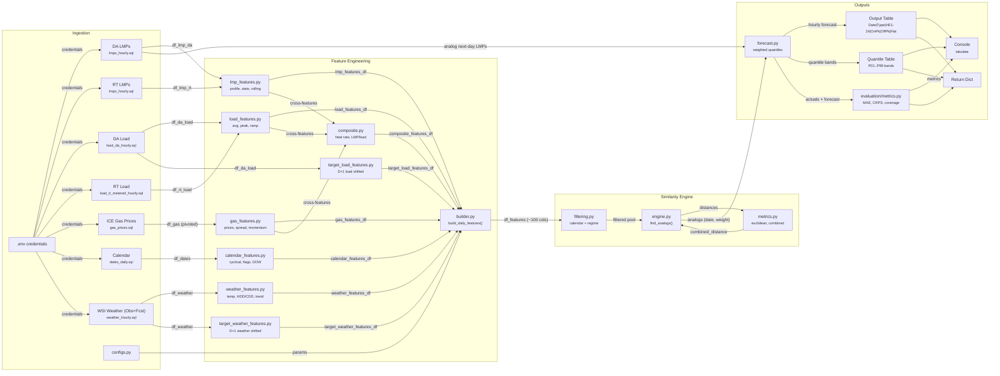

# Like-Day Model — Discovery & Data Flow Documentation

> **Phase:** Discovery/Documentation only. No code changes.
> **Scope:** `backend/src/like_day_forecast/` — external dependencies included only when required.
> **Evidence rule:** Every claim maps to `path:line`. Anything inferred is marked `assumption`.

All paths below are relative to `backend/src/like_day_forecast/`.

---

## 1) Data Sources Inventory

| Source | Type | Where Referenced | Purpose | Output Used By | Risks / Unknowns |
|--------|------|------------------|---------|----------------|-------------------|
| `pjm_cleaned.pjm_lmps_hourly` (DA) | db | `data/lmps_hourly.py`, `sql/lmps_hourly.sql` | Hourly DA LMP by hub | `features/lmp_features.py`, `pipelines/forecast.py` (analog next-day pull) | Hub limited to WESTERN HUB |
| `pjm_cleaned.pjm_lmps_hourly` (RT) | db | `data/lmps_hourly.py`, `sql/lmps_hourly.sql` | Hourly RT LMP for DART spread | `features/lmp_features.py` | RT data used only for DART spread; if unavailable, feature is skipped |
| `pjm_cleaned.pjm_load_da_hourly` | db | `data/load_da_hourly.py`, `sql/load_da_hourly.sql` | DA load forecast (2020+) | `features/load_features.py`, `features/target_load_features.py` | Only available 2020+; falls back to RT metered for earlier dates |
| `pjm_cleaned.pjm_load_rt_metered_hourly` | db | `data/load_rt_metered_hourly.py`, `sql/load_rt_metered_hourly.sql` | RT metered load (2014+) | `features/load_features.py` (fallback) | Used as fallback when DA load unavailable |
| `ice_python_cleaned.ice_python_next_day_gas_daily` | db | `data/gas_prices.py`, `sql/gas_prices.sql` | ICE next-day gas daily snapshot (TETCO M3, Henry Hub) | `features/gas_features.py` | Columns: `tetco_m3_cash` → `gas_m3_price`, `hh_cash` → `gas_hh_price` |
| `pjm_cleaned.pjm_dates_daily` | db | `data/dates.py`, `sql/dates_daily.sql` | Calendar (DOW, holidays, season) | `features/calendar_features.py` | Relies on upstream NERC holiday table accuracy |
| `wsi_cleaned.temp_observed_hourly` + `wsi_cleaned.temp_forecast_hourly` | db | `data/weather_hourly.py`, `sql/weather_hourly.sql` | WSI observed + forecast hourly temperature | `features/weather_features.py`, `features/target_weather_features.py` | Observed for historical dates; forecast for today+ via UNION ALL. Only `temperature` column available (aliased as `temp`) |
| `.env` file | env | `settings.py:7-9` | Azure PostgreSQL credentials | `utils/azure_postgresql.py` | Credentials in plaintext file at `src/.env` |
| `configs.py` | module | `configs.py` | All tuneable parameters (schema, weights, filters) | Every module imports `configs` | Schema: `pjm_cleaned`, weather schema: `wsi_cleaned` |

---

## 2) Data Flow Summary

### Step 1 — Data Ingestion

- **Name:** Pull raw data from Azure PostgreSQL
- **Key functions/files:**
  - `data/lmps_hourly.py:12` → `pull(schema, hub, market)`
  - `data/load_da_hourly.py:12` → `pull(schema, region)`
  - `data/load_rt_metered_hourly.py:12` → `pull(schema, region)`
  - `data/gas_prices.py:12` → `pull()`
  - `data/dates.py:12` → `pull_daily(schema)`
  - `data/weather_hourly.py:12` → `pull(schema, station)`
  - All route through `utils/azure_postgresql.py` → `pull_from_db(query, database)`
- **Input shape:** SQL queries parameterized with schema/hub/region/station
- **Transformation:** `pd.read_sql()` → DataFrame; gas prices returned pre-shaped from ICE mart; weather combines observed + forecast via UNION ALL
- **Output shape:** 6 raw DataFrames (hourly LMPs DA & RT, DA load, RT load, gas prices, calendar, weather)
- **Downstream:** Step 2 (Feature Engineering)

### Step 2 — Feature Engineering

- **Name:** Build daily feature matrix
- **Key functions/files:** `features/builder.py:32` → `build_daily_features(schema)`
- **Input shape:** 6 raw hourly/daily DataFrames from Step 1
- **Transformation:** Orchestrates 8 feature modules, each producing daily features:

| Module | File | Key Features | Count |
|--------|------|-------------|-------|
| LMP features | `features/lmp_features.py:21` | Profile (asinh h1-h24), daily stats, rolling 7d/30d, component shares, DART | ~30+ |
| Load features | `features/load_features.py:13` | Daily avg/peak/valley, peak ratio, ramp max, rolling 7d | ~8 |
| Gas features | `features/gas_features.py:13` | M3, HH prices, M3-HH spread, 7d/30d momentum | ~6 |
| Calendar features | `features/calendar_features.py:14` | Cyclical sin/cos (DOW, month, DOY), binary flags, one-hot DOW | ~20 |
| Weather features | `features/weather_features.py:16` | Temp avg/max/min, HDD/CDD, intraday range, rolling 7d, daily change | ~8 |
| Composite features | `features/composite.py:13` | Implied heat rate (LMP/gas), LMP per load | 2 |
| Target load (D+1) | `features/target_load_features.py:17` | D+1 load shifted to D, cross-day delta | ~5 |
| Target weather (D+1) | `features/target_weather_features.py:17` | D+1 weather shifted to D, cross-day delta | ~6 |

- **Output shape:** Single merged DataFrame, ~100+ columns, 1 row per date, filtered to 2021-01-01+ (`builder.py:119`), NaN warmup rows dropped (`builder.py:123-125`)
- **Downstream:** Step 3 (Analog Filtering & Matching)

### Step 3 — Pre-Filtering (Calendar + Regime)

- **Name:** Reduce candidate pool by structural similarity
- **Key functions/files:**
  - `similarity/filtering.py:17` → `calendar_filter(df, target_date, same_dow_group, season_window_days)`
  - `similarity/filtering.py:67` → `regime_filter(df, target_date, lmp_col, gas_col, ...)`
  - `similarity/filtering.py:133` → `ensure_minimum_pool(df_filtered, df_full, target_date, min_size)`
- **Input shape:** Full daily feature matrix + target date
- **Transformation:**
  - Exclude target date and future dates
  - Same DOW group (weekday/Sat/Sun) — `configs.py:56-60`
  - Seasonal window ±30 days from day-of-year — `configs.py:55`
  - LMP regime: exclude candidates >1.5 std from target's LMP level
  - Gas regime: same for gas prices
  - If pool < 20, relax constraints — `configs.py:63`
- **Output shape:** Filtered DataFrame (subset of rows)
- **Downstream:** Step 4 (Distance Computation)

### Step 4 — Analog Distance Computation & Ranking

- **Name:** Z-score normalize, compute weighted multi-group distances, rank
- **Key functions/files:**
  - `similarity/engine.py:179` → `find_analogs(target_date, df_features, n_analogs, ...)`
  - `similarity/engine.py:111` → `_normalize_features()` (Z-score)
  - `similarity/metrics.py:70` → `combined_distance()` (per-group weighted blend)
  - `similarity/engine.py:136` → `compute_analog_weights(distances, method)`
- **Input shape:** Filtered feature matrix + target row
- **Transformation:**
  1. Z-score normalize each feature across filtered pool (`engine.py:265-273`)
  2. For each candidate: compute per-group Euclidean distance across 17 feature groups (`engine.py:276-299`)
  3. Weighted blend across groups using expert-tuned weights (`configs.py:33-51`)
  4. Sort by total distance, take top-N (default 30)
  5. Compute analog weights: inverse-distance `w_i = 1/(d_i + 1e-8)^2` (`engine.py:310`)
- **Output shape:** DataFrame with columns `[date, rank, distance, similarity, weight]`, N rows
- **Downstream:** Step 5 (Forecast Construction)

### Step 5 — Probabilistic Forecast Construction

- **Name:** Weighted quantile forecast from analog next-day LMPs
- **Key functions/files:** `pipelines/forecast.py:108-155`
- **Input shape:** Analog dates + weights + full LMP history
- **Transformation:**
  1. For each analog date D, look up D+1 DA LMPs (`forecast.py:111`)
  2. Match analog weights to next-day hourly LMPs (`forecast.py:116-119`)
  3. For each hour (HE1-24):
     - Weighted point forecast (weighted mean) (`forecast.py:143`)
     - Weighted quantiles at [0.01, 0.05, 0.10, 0.25, 0.50, 0.75, 0.90, 0.95, 0.99] (`forecast.py:149`)
- **Output shape:** `df_forecast` — 24 rows (hours) × (point_forecast + 9 quantile columns)
- **Downstream:** Steps 6 & 7 (Output Formatting)

### Step 6 — Output Table Construction

- **Name:** Build pivoted Actual / Forecast / Error table
- **Key functions/files:** `pipelines/forecast.py:221` → `_build_output_table()`
- **Input shape:** Hourly forecast dict + hourly actuals dict (if available)
- **Transformation:**
  - Pivot hours to columns (HE1-24)
  - Compute summary columns: OnPeak (mean HE8-23), OffPeak (mean HE1-7 + HE24), Flat (mean all)
  - Add Error row if actuals exist
- **Output shape:** DataFrame: `Date | Type | HE1-24 | OnPeak | OffPeak | Flat` (2-3 rows)
- **Downstream:** Console output, return dict

### Step 7 — Quantile Table Construction

- **Name:** Build quantile bands table
- **Key functions/files:** `pipelines/forecast.py:172-184`
- **Input shape:** `df_forecast` with quantile columns
- **Transformation:** Extract each quantile band, pivot to hourly columns, compute summaries
- **Output shape:** DataFrame: `Date | Type | HE1-24 | OnPeak | OffPeak | Flat` (9 rows, Type = P01..P99)
- **Downstream:** Console output, return dict

### Step 8 — Forecast Evaluation

- **Name:** Compute accuracy metrics (if actuals available)
- **Key functions/files:** `evaluation/metrics.py:80` → `evaluate_forecast()`
- **Input shape:** 24-element actual array + forecast DataFrame + quantiles
- **Transformation:** Compute MAE, RMSE, MAPE, rMAE, pinball loss (per-quantile), coverage (80/90/98%), sharpness, CRPS
- **Output shape:** Dict with ~20 metric keys
- **Downstream:** Console output, return dict

### Step 9 — Console Output & Return

- **Name:** Print tables and return results
- **Key functions/files:**
  - `pipelines/forecast.py:255` → `_print_analogs()`
  - `pipelines/forecast.py:274` → `_print_table()`
  - `pipelines/forecast.py:328` → `_print_quantiles()`
  - `pipelines/forecast.py:208-218` → return dict
- **Input shape:** All outputs from Steps 4-8
- **Output shape:** Console tables via `tabulate` + return dict:
  ```python
  {
      "output_table": pd.DataFrame,
      "quantiles_table": pd.DataFrame,
      "analogs": pd.DataFrame,
      "metrics": dict | None,
      "forecast_date": str,
      "reference_date": str,
      "has_actuals": bool,
      "n_analogs_used": int,
      "df_forecast": pd.DataFrame,
  }
  ```
- **Downstream:** Caller (notebook, script, or API) — `assumption`: no downstream consumer defined in this repo

---

## 3) Static Diagram



---

## 4) Interactive Graph Spec (JSON)

```json
{
  "nodes": [
    {
      "id": "src-lmp-da",
      "label": "DA LMPs (WESTERN HUB)",
      "kind": "source",
      "layer": "ingestion",
      "fileRefs": ["data/lmps_hourly.py:12", "sql/lmps_hourly.sql:1"],
      "description": "Hourly DA LMP from pjm_cleaned.pjm_lmps_hourly. Columns: date, hour_ending, hub, market, lmp_total, lmp_system_energy_price, lmp_congestion_price, lmp_marginal_loss_price.",
      "confidence": "high"
    },
    {
      "id": "src-lmp-rt",
      "label": "RT LMPs (WESTERN HUB)",
      "kind": "source",
      "layer": "ingestion",
      "fileRefs": ["data/lmps_hourly.py:12", "sql/lmps_hourly.sql:1"],
      "description": "Hourly RT LMP from pjm_cleaned.pjm_lmps_hourly, market='rt'. Used for DART spread feature only.",
      "confidence": "high"
    },
    {
      "id": "src-load-da",
      "label": "DA Load Forecast (RTO)",
      "kind": "source",
      "layer": "ingestion",
      "fileRefs": ["data/load_da_hourly.py:12", "sql/load_da_hourly.sql:1"],
      "description": "DA load forecast hourly. Available 2020+. Columns: date, hour_ending, region, da_load_mw.",
      "confidence": "high"
    },
    {
      "id": "src-load-rt",
      "label": "RT Metered Load (RTO)",
      "kind": "source",
      "layer": "ingestion",
      "fileRefs": ["data/load_rt_metered_hourly.py:12", "sql/load_rt_metered_hourly.sql:1"],
      "description": "RT metered load hourly. Available 2014+. Fallback when DA load unavailable.",
      "confidence": "high"
    },
    {
      "id": "src-gas",
      "label": "ICE Next-Day Gas",
      "kind": "source",
      "layer": "ingestion",
      "fileRefs": ["data/gas_prices.py:12", "sql/gas_prices.sql:1"],
      "description": "Daily gas prices from ice_python_cleaned.ice_python_next_day_gas_daily. Columns: gas_m3_price (tetco_m3_cash), gas_hh_price (hh_cash).",
      "confidence": "high"
    },
    {
      "id": "src-dates",
      "label": "Calendar / Dates",
      "kind": "source",
      "layer": "ingestion",
      "fileRefs": ["data/dates.py:12", "sql/dates_daily.sql:1"],
      "description": "Daily calendar: day_of_week_number, is_weekend, is_nerc_holiday, summer_winter.",
      "confidence": "high"
    },
    {
      "id": "src-weather",
      "label": "WSI Weather (Observed + Forecast)",
      "kind": "source",
      "layer": "ingestion",
      "fileRefs": ["data/weather_hourly.py:12", "sql/weather_hourly.sql:1"],
      "description": "Hourly temperature from wsi_cleaned: observed (temp_observed_hourly) for historical dates UNION forecast (temp_forecast_hourly) for today+. Column: temp.",
      "confidence": "high"
    },
    {
      "id": "src-env",
      "label": ".env Credentials",
      "kind": "source",
      "layer": "ingestion",
      "fileRefs": ["settings.py:7-9"],
      "description": "Azure PostgreSQL connection credentials loaded from src/.env via python-dotenv.",
      "confidence": "high"
    },
    {
      "id": "src-configs",
      "label": "configs.py",
      "kind": "source",
      "layer": "ingestion",
      "fileRefs": ["configs.py:1-85"],
      "description": "Central configuration: schemas (pjm_cleaned, wsi_cleaned), feature group weights, filter params, hub/region, quantiles.",
      "confidence": "high"
    },
    {
      "id": "proc-db-conn",
      "label": "Azure PostgreSQL Connector",
      "kind": "process",
      "layer": "ingestion",
      "fileRefs": ["utils/azure_postgresql.py:13-31"],
      "description": "psycopg2 connection factory + pd.read_sql executor. All data pulls route through pull_from_db().",
      "confidence": "high"
    },
    {
      "id": "proc-feat-lmp",
      "label": "LMP Feature Builder",
      "kind": "process",
      "layer": "transform",
      "fileRefs": ["features/lmp_features.py:21"],
      "description": "Builds ~30 daily features: asinh-transformed hourly profile (h1-h24), daily stats (flat, std, range, onpeak/offpeak), rolling 7d/30d means, component shares (congestion/energy), DART spread.",
      "confidence": "high"
    },
    {
      "id": "proc-feat-load",
      "label": "Load Feature Builder",
      "kind": "process",
      "layer": "transform",
      "fileRefs": ["features/load_features.py:13"],
      "description": "Builds ~8 daily features: avg/peak/valley, peak_ratio, ramp_max, rolling 7d, day-over-day change. Prefers DA load, falls back to RT metered.",
      "confidence": "high"
    },
    {
      "id": "proc-feat-gas",
      "label": "Gas Feature Builder",
      "kind": "process",
      "layer": "transform",
      "fileRefs": ["features/gas_features.py:13"],
      "description": "Builds ~6 daily features: M3/HH raw prices, M3-HH spread, 7d change, 30d moving average.",
      "confidence": "high"
    },
    {
      "id": "proc-feat-cal",
      "label": "Calendar Feature Builder",
      "kind": "process",
      "layer": "transform",
      "fileRefs": ["features/calendar_features.py:14"],
      "description": "Builds ~20 features: cyclical sin/cos (DOW, month, DOY), binary flags (weekend, holiday, season), one-hot DOW.",
      "confidence": "high"
    },
    {
      "id": "proc-feat-wx",
      "label": "Weather Feature Builder",
      "kind": "process",
      "layer": "transform",
      "fileRefs": ["features/weather_features.py:16"],
      "description": "Builds ~8 features: daily temp avg/max/min, intraday range, HDD/CDD (base 65F), rolling 7d, daily change. Optional columns (feels_like, wind, humidity, cloud_cover) included if present.",
      "confidence": "high"
    },
    {
      "id": "proc-feat-composite",
      "label": "Composite Feature Builder",
      "kind": "process",
      "layer": "transform",
      "fileRefs": ["features/composite.py:13"],
      "description": "Builds 2 cross-domain features: implied heat rate (LMP/gas), LMP per load (LMP/demand).",
      "confidence": "high"
    },
    {
      "id": "proc-feat-tgt-load",
      "label": "Target Load (D+1) Builder",
      "kind": "process",
      "layer": "transform",
      "fileRefs": ["features/target_load_features.py:17"],
      "description": "Shifts D+1 DA load features back to reference date D. ~5 features including cross-day delta. DA load for D+1 available by 1:30 PM.",
      "confidence": "high"
    },
    {
      "id": "proc-feat-tgt-wx",
      "label": "Target Weather (D+1) Builder",
      "kind": "process",
      "layer": "transform",
      "fileRefs": ["features/target_weather_features.py:17"],
      "description": "Shifts D+1 weather back to D. ~5 features including cross-day delta. Uses forecast temps for D+1 when observed not yet available.",
      "confidence": "high"
    },
    {
      "id": "proc-builder",
      "label": "Feature Matrix Builder",
      "kind": "process",
      "layer": "transform",
      "fileRefs": ["features/builder.py:32"],
      "description": "Orchestrates all data pulls + feature builds. Merges on date, filters to 2021-01-01+, drops NaN warmup rows. Output: ~100+ feature columns, 1 row/day.",
      "confidence": "high"
    },
    {
      "id": "proc-filter-cal",
      "label": "Calendar Filter",
      "kind": "process",
      "layer": "transform",
      "fileRefs": ["similarity/filtering.py:17"],
      "description": "Excludes target/future dates, enforces same DOW group (weekday/Sat/Sun), seasonal ±30 day window.",
      "confidence": "high"
    },
    {
      "id": "proc-filter-regime",
      "label": "Regime Filter",
      "kind": "process",
      "layer": "transform",
      "fileRefs": ["similarity/filtering.py:67"],
      "description": "Excludes candidates >1.5 std from target's LMP and gas price levels. Prevents cross-regime matching.",
      "confidence": "high"
    },
    {
      "id": "proc-filter-min",
      "label": "Minimum Pool Guarantee",
      "kind": "process",
      "layer": "transform",
      "fileRefs": ["similarity/filtering.py:133"],
      "description": "If filtered pool <20 candidates, relaxes constraints. Falls back to date-proximity ordering.",
      "confidence": "high"
    },
    {
      "id": "proc-engine",
      "label": "Analog Matching Engine",
      "kind": "process",
      "layer": "transform",
      "fileRefs": ["similarity/engine.py:179"],
      "description": "Z-score normalizes filtered pool, computes per-group Euclidean distances across 17 feature groups, weighted blend, ranks top-N (default 30). Outputs analog dates + inverse-distance weights.",
      "confidence": "high"
    },
    {
      "id": "proc-distance",
      "label": "Distance Metrics",
      "kind": "process",
      "layer": "transform",
      "fileRefs": ["similarity/metrics.py:15-122"],
      "description": "Euclidean, cosine, MAE, pattern distances. combined_distance() blends per-group scores using expert weights.",
      "confidence": "high"
    },
    {
      "id": "proc-forecast",
      "label": "Weighted Quantile Forecast",
      "kind": "process",
      "layer": "output",
      "fileRefs": ["pipelines/forecast.py:108-155"],
      "description": "For each analog D, retrieves D+1 DA LMPs. Computes weighted point forecast and 9 quantile bands (P01-P99) for each hour HE1-24.",
      "confidence": "high"
    },
    {
      "id": "proc-output-table",
      "label": "Output Table Builder",
      "kind": "process",
      "layer": "output",
      "fileRefs": ["pipelines/forecast.py:221"],
      "description": "Pivots hourly forecast to Date|Type|HE1-24|OnPeak|OffPeak|Flat. Rows: Actual/Forecast/Error.",
      "confidence": "high"
    },
    {
      "id": "proc-quantile-table",
      "label": "Quantile Table Builder",
      "kind": "process",
      "layer": "output",
      "fileRefs": ["pipelines/forecast.py:172-184"],
      "description": "Builds 9-row table of quantile bands (P01..P99) in same pivot format.",
      "confidence": "high"
    },
    {
      "id": "proc-eval",
      "label": "Forecast Evaluator",
      "kind": "process",
      "layer": "output",
      "fileRefs": ["evaluation/metrics.py:80"],
      "description": "Computes MAE, RMSE, MAPE, rMAE, pinball loss, coverage (80/90/98%), sharpness, CRPS. Only runs when actuals available.",
      "confidence": "high"
    },
    {
      "id": "sink-console",
      "label": "Console Output",
      "kind": "sink",
      "layer": "output",
      "fileRefs": ["pipelines/forecast.py:255-350"],
      "description": "Prints analog table, forecast table, quantile bands, and metrics via tabulate.",
      "confidence": "high"
    },
    {
      "id": "sink-return",
      "label": "Return Dict",
      "kind": "sink",
      "layer": "output",
      "fileRefs": ["pipelines/forecast.py:208-218"],
      "description": "Returns dict with output_table, quantiles_table, analogs, metrics, forecast_date, reference_date, has_actuals, n_analogs_used, df_forecast.",
      "confidence": "high"
    },
    {
      "id": "store-logs",
      "label": "Log Files",
      "kind": "store",
      "layer": "storage",
      "fileRefs": ["utils/logging_utils.py:138", "settings.py:12"],
      "description": "PipelineLogger writes to logs/pjm-like-day-forecast_{timestamp}.log. Colored console output + file handler.",
      "confidence": "high"
    }
  ],
  "edges": [
    {
      "id": "e-env-to-conn",
      "source": "src-env",
      "target": "proc-db-conn",
      "dataObject": "credentials (host, port, db, user, password)",
      "operation": "read",
      "mode": "sync",
      "fileRefs": ["settings.py:15-19", "utils/azure_postgresql.py:15-19"],
      "confidence": "high"
    },
    {
      "id": "e-configs-to-builder",
      "source": "src-configs",
      "target": "proc-builder",
      "dataObject": "schema, hub, region, date ranges, feature weights",
      "operation": "read",
      "mode": "sync",
      "fileRefs": ["configs.py:5-84"],
      "confidence": "high"
    },
    {
      "id": "e-db-lmp-da",
      "source": "src-lmp-da",
      "target": "proc-db-conn",
      "dataObject": "df_lmp_da (date, hour_ending, lmp_total, components)",
      "operation": "read",
      "mode": "sync",
      "fileRefs": ["data/lmps_hourly.py:18-22"],
      "confidence": "high"
    },
    {
      "id": "e-db-lmp-rt",
      "source": "src-lmp-rt",
      "target": "proc-db-conn",
      "dataObject": "df_lmp_rt (date, hour_ending, lmp_total, components)",
      "operation": "read",
      "mode": "sync",
      "fileRefs": ["data/lmps_hourly.py:18-22"],
      "confidence": "high"
    },
    {
      "id": "e-db-load-da",
      "source": "src-load-da",
      "target": "proc-db-conn",
      "dataObject": "df_da_load (date, hour_ending, da_load_mw)",
      "operation": "read",
      "mode": "sync",
      "fileRefs": ["data/load_da_hourly.py:17-21"],
      "confidence": "high"
    },
    {
      "id": "e-db-load-rt",
      "source": "src-load-rt",
      "target": "proc-db-conn",
      "dataObject": "df_rt_load (date, hour_ending, rt_load_mw)",
      "operation": "read",
      "mode": "sync",
      "fileRefs": ["data/load_rt_metered_hourly.py:17-21"],
      "confidence": "high"
    },
    {
      "id": "e-db-gas",
      "source": "src-gas",
      "target": "proc-db-conn",
      "dataObject": "df_gas (date, gas_m3_price, gas_hh_price)",
      "operation": "read",
      "mode": "sync",
      "fileRefs": ["data/gas_prices.py:19-42"],
      "confidence": "high"
    },
    {
      "id": "e-db-dates",
      "source": "src-dates",
      "target": "proc-db-conn",
      "dataObject": "df_dates (date, day_of_week_number, is_weekend, is_nerc_holiday, summer_winter)",
      "operation": "read",
      "mode": "sync",
      "fileRefs": ["data/dates.py:16-20"],
      "confidence": "high"
    },
    {
      "id": "e-db-weather",
      "source": "src-weather",
      "target": "proc-db-conn",
      "dataObject": "df_weather (date, hour_ending, temp) — observed + forecast UNION",
      "operation": "read",
      "mode": "sync",
      "fileRefs": ["data/weather_hourly.py:18-22"],
      "confidence": "high"
    },
    {
      "id": "e-conn-to-feat-lmp",
      "source": "proc-db-conn",
      "target": "proc-feat-lmp",
      "dataObject": "df_lmp_da, df_lmp_rt",
      "operation": "transform",
      "mode": "sync",
      "fileRefs": ["features/builder.py:44-47"],
      "confidence": "high"
    },
    {
      "id": "e-conn-to-feat-load",
      "source": "proc-db-conn",
      "target": "proc-feat-load",
      "dataObject": "df_da_load, df_rt_load",
      "operation": "transform",
      "mode": "sync",
      "fileRefs": ["features/builder.py:56-61"],
      "confidence": "high"
    },
    {
      "id": "e-conn-to-feat-gas",
      "source": "proc-db-conn",
      "target": "proc-feat-gas",
      "dataObject": "df_gas",
      "operation": "transform",
      "mode": "sync",
      "fileRefs": ["features/builder.py:50"],
      "confidence": "high"
    },
    {
      "id": "e-conn-to-feat-cal",
      "source": "proc-db-conn",
      "target": "proc-feat-cal",
      "dataObject": "df_dates",
      "operation": "transform",
      "mode": "sync",
      "fileRefs": ["features/builder.py:53"],
      "confidence": "high"
    },
    {
      "id": "e-conn-to-feat-wx",
      "source": "proc-db-conn",
      "target": "proc-feat-wx",
      "dataObject": "df_weather",
      "operation": "transform",
      "mode": "sync",
      "fileRefs": ["features/builder.py:68"],
      "confidence": "high"
    },
    {
      "id": "e-feat-lmp-to-composite",
      "source": "proc-feat-lmp",
      "target": "proc-feat-composite",
      "dataObject": "lmp_features_df",
      "operation": "transform",
      "mode": "sync",
      "fileRefs": ["features/builder.py:109"],
      "confidence": "high"
    },
    {
      "id": "e-feat-gas-to-composite",
      "source": "proc-feat-gas",
      "target": "proc-feat-composite",
      "dataObject": "gas_features_df",
      "operation": "transform",
      "mode": "sync",
      "fileRefs": ["features/builder.py:109"],
      "confidence": "high"
    },
    {
      "id": "e-feat-load-to-composite",
      "source": "proc-feat-load",
      "target": "proc-feat-composite",
      "dataObject": "load_features_df",
      "operation": "transform",
      "mode": "sync",
      "fileRefs": ["features/builder.py:109"],
      "confidence": "high"
    },
    {
      "id": "e-feat-load-to-tgt-load",
      "source": "proc-feat-load",
      "target": "proc-feat-tgt-load",
      "dataObject": "df_ref_load_features",
      "operation": "transform",
      "mode": "sync",
      "fileRefs": ["features/target_load_features.py:57-58"],
      "confidence": "high"
    },
    {
      "id": "e-feat-wx-to-tgt-wx",
      "source": "proc-feat-wx",
      "target": "proc-feat-tgt-wx",
      "dataObject": "df_ref_weather_features",
      "operation": "transform",
      "mode": "sync",
      "fileRefs": ["features/target_weather_features.py:56-57"],
      "confidence": "high"
    },
    {
      "id": "e-all-feats-to-builder",
      "source": "proc-feat-lmp",
      "target": "proc-builder",
      "dataObject": "lmp_features_df",
      "operation": "transform",
      "mode": "sync",
      "fileRefs": ["features/builder.py:109-116"],
      "confidence": "high"
    },
    {
      "id": "e-builder-to-filter",
      "source": "proc-builder",
      "target": "proc-filter-cal",
      "dataObject": "df_features (~100+ cols, daily)",
      "operation": "transform",
      "mode": "sync",
      "fileRefs": ["similarity/engine.py:192"],
      "confidence": "high"
    },
    {
      "id": "e-filter-cal-to-regime",
      "source": "proc-filter-cal",
      "target": "proc-filter-regime",
      "dataObject": "calendar-filtered pool",
      "operation": "transform",
      "mode": "sync",
      "fileRefs": ["similarity/engine.py:193"],
      "confidence": "high"
    },
    {
      "id": "e-filter-regime-to-min",
      "source": "proc-filter-regime",
      "target": "proc-filter-min",
      "dataObject": "regime-filtered pool",
      "operation": "transform",
      "mode": "sync",
      "fileRefs": ["similarity/engine.py:194"],
      "confidence": "high"
    },
    {
      "id": "e-filter-to-engine",
      "source": "proc-filter-min",
      "target": "proc-engine",
      "dataObject": "final candidate pool (≥20 rows)",
      "operation": "transform",
      "mode": "sync",
      "fileRefs": ["similarity/engine.py:198"],
      "confidence": "high"
    },
    {
      "id": "e-engine-uses-metrics",
      "source": "proc-engine",
      "target": "proc-distance",
      "dataObject": "feature vectors (target vs candidate)",
      "operation": "call",
      "mode": "sync",
      "fileRefs": ["similarity/engine.py:276-299"],
      "confidence": "high"
    },
    {
      "id": "e-engine-to-forecast",
      "source": "proc-engine",
      "target": "proc-forecast",
      "dataObject": "analogs_df (date, rank, distance, similarity, weight)",
      "operation": "transform",
      "mode": "sync",
      "fileRefs": ["pipelines/forecast.py:105"],
      "confidence": "high"
    },
    {
      "id": "e-lmp-to-forecast",
      "source": "src-lmp-da",
      "target": "proc-forecast",
      "dataObject": "analog next-day DA LMPs (hourly)",
      "operation": "read",
      "mode": "sync",
      "fileRefs": ["pipelines/forecast.py:108-119"],
      "confidence": "high"
    },
    {
      "id": "e-forecast-to-output",
      "source": "proc-forecast",
      "target": "proc-output-table",
      "dataObject": "hourly point forecast dict",
      "operation": "transform",
      "mode": "sync",
      "fileRefs": ["pipelines/forecast.py:169"],
      "confidence": "high"
    },
    {
      "id": "e-forecast-to-quantile",
      "source": "proc-forecast",
      "target": "proc-quantile-table",
      "dataObject": "df_forecast with quantile columns",
      "operation": "transform",
      "mode": "sync",
      "fileRefs": ["pipelines/forecast.py:172-184"],
      "confidence": "high"
    },
    {
      "id": "e-forecast-to-eval",
      "source": "proc-forecast",
      "target": "proc-eval",
      "dataObject": "actuals + forecast arrays",
      "operation": "transform",
      "mode": "sync",
      "fileRefs": ["pipelines/forecast.py:188-201"],
      "confidence": "high"
    },
    {
      "id": "e-output-to-console",
      "source": "proc-output-table",
      "target": "sink-console",
      "dataObject": "formatted table string",
      "operation": "write",
      "mode": "sync",
      "fileRefs": ["pipelines/forecast.py:274"],
      "confidence": "high"
    },
    {
      "id": "e-quantile-to-console",
      "source": "proc-quantile-table",
      "target": "sink-console",
      "dataObject": "formatted quantile table string",
      "operation": "write",
      "mode": "sync",
      "fileRefs": ["pipelines/forecast.py:328"],
      "confidence": "high"
    },
    {
      "id": "e-eval-to-console",
      "source": "proc-eval",
      "target": "sink-console",
      "dataObject": "metrics summary",
      "operation": "write",
      "mode": "sync",
      "fileRefs": ["pipelines/forecast.py:274"],
      "confidence": "high"
    },
    {
      "id": "e-all-to-return",
      "source": "proc-forecast",
      "target": "sink-return",
      "dataObject": "result dict (output_table, quantiles_table, analogs, metrics, ...)",
      "operation": "write",
      "mode": "sync",
      "fileRefs": ["pipelines/forecast.py:208-218"],
      "confidence": "high"
    },
    {
      "id": "e-logger-to-logs",
      "source": "proc-builder",
      "target": "store-logs",
      "dataObject": "log messages",
      "operation": "write",
      "mode": "async",
      "fileRefs": ["settings.py:12", "utils/logging_utils.py:138"],
      "confidence": "high"
    }
  ],
  "subgraphs": [
    {
      "id": "sg-ingestion",
      "label": "Data Ingestion",
      "nodeIds": ["src-lmp-da", "src-lmp-rt", "src-load-da", "src-load-rt", "src-gas", "src-dates", "src-weather", "src-env", "src-configs", "proc-db-conn"]
    },
    {
      "id": "sg-feature-engineering",
      "label": "Feature Engineering",
      "nodeIds": ["proc-feat-lmp", "proc-feat-load", "proc-feat-gas", "proc-feat-cal", "proc-feat-wx", "proc-feat-composite", "proc-feat-tgt-load", "proc-feat-tgt-wx", "proc-builder"]
    },
    {
      "id": "sg-similarity",
      "label": "Similarity Engine (pjm_like_day)",
      "nodeIds": ["proc-filter-cal", "proc-filter-regime", "proc-filter-min", "proc-engine", "proc-distance"]
    },
    {
      "id": "sg-output",
      "label": "Forecast & Output",
      "nodeIds": ["proc-forecast", "proc-output-table", "proc-quantile-table", "proc-eval", "sink-console", "sink-return", "store-logs"]
    }
  ]
}
```

---

## 5) Gaps + Next Validation Steps

### Unknowns

| # | Unknown | Evidence | Impact | Validation Step |
|---|---------|----------|--------|-----------------|
| U1 | **No downstream consumer defined** — `forecast.run()` returns a dict, but nothing in the repo consumes it beyond notebooks | No import of `forecast.run` found outside `like-day-model/` | Output format may drift without integration tests | Check `backend/` and `frontend/` for any API endpoints that call this pipeline |
| U2 | **Schemas now use stable names** — `pjm_cleaned`, `wsi_cleaned`, `ice_python_cleaned` in `configs.py` | Resolved: no more versioned schema names | Low — schema names are stable DBT mart schemas | N/A |
| U3 | **Target weather uses forecast for D+1** — `weather_hourly.sql` UNIONs observed + forecast | Forecast temps fill the D+1 gap in production | Forecast accuracy may differ from observed; verify forecast data freshness | Compare forecast vs observed temps for recent dates to assess error |
| U4 | **Gas prices from `ice_python_cleaned`** | `gas_prices.sql` queries `ice_python_cleaned.ice_python_next_day_gas_daily` | Stable mart schema; only M3 and HH hubs used | Verify data recency; add staleness check |
| U5 | **No data freshness / staleness checks** | No module validates that the most recent data row is within expected range | Stale data could silently produce a forecast from outdated analogs | Add a check in `builder.py` that the max date is within 2 days of today |
| U6 | **Analog next-day LMP lookup assumes consecutive dates** | `forecast.py:111` uses `analog_date + timedelta(days=1)` | Holidays/weekends with missing data could yield NaN next-day LMPs | Count how many analogs lose their next-day data; check `n_analogs_used` vs `n_analogs` |

### Assumptions (marked low-confidence)

| # | Assumption | Basis | Validation Step |
|---|-----------|-------|-----------------|
| A1 | `forecast.run()` is the sole entry point for production use | Only orchestrator found; no scheduled task or API call discovered | Check for cron jobs, Azure Functions, or API routes that invoke the pipeline |
| A2 | Feature group weights in `configs.py:33-51` are expert-tuned, not optimized | Weights are round numbers (1.0, 2.0, 3.0) with no optimization code | Ask domain expert or check git history for weight tuning rationale |
| A3 | `preprocessing.asinh_transform` is applied consistently before distance computation | `lmp_features.py:83-87` applies it, but `engine.py` z-scores raw feature values | Verify whether double-transformation (asinh then z-score) is intentional |
| A4 | The `backend/src/pjm_like_day/` directory (now deleted on this branch) was a predecessor | Git status shows it as deleted; code patterns overlap | Check `git log` for migration history |

### Concrete Next Steps

1. **Run the pipeline end-to-end** for a recent date to capture actual DataFrame shapes and column counts at each step
2. **Validate feature completeness** — count non-null features per date; identify systematic NaN patterns (especially pre-2020 for DA load)
3. **Profile the candidate pool** — for a sample target date, log pool size after each filter stage (calendar → regime → minimum guarantee)
4. **Audit the weight assignment** — run `find_analogs` and inspect whether top analogs are sensibly similar (spot check 5-10 dates)
5. **Check `n_analogs_used` drop-off** — how many of the 30 analogs lose their next-day data due to the D+1 lookup?
6. **Map to `backend/src/pjm_like_day/`** — compare the deleted predecessor code to understand what changed and why
7. **Verify target feature NaN handling** — confirm `target_weather_features` and `target_load_features` are correctly excluded from similarity groups when running in production mode (future target date)
